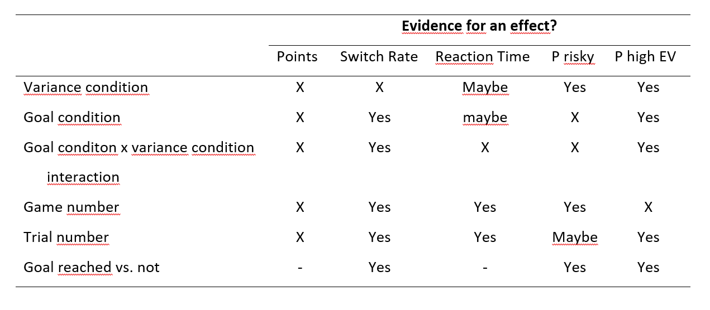

```{r setup, include=FALSE}

library(yarrr)
library(knitr)
library(BayesFactor)
opts_chunk$set(echo = TRUE)
opts_knit$set(root.dir = "C:/Users/Markus/Dropbox/Masterarbeit/eegoals")
```

# Goal Bandit First Analysis

## Summary

There were 4 between subjects conditions. Two factors were varied: The environment and whether there was a goal, i.e. a minimum number of points, to be reached or not. The four conditions were

1. LN - high EV is low variance, no goal
2. HN - high EV is high variance, no goal
3. LG - high EV is low variance, goal
4. HG - high EV is high variance, goal

The high EV is low variance environment had the following means and sds:

Mean | SD
-----|------
3 | 2
2 | 2.5
2 | 5

Table: Means and sds of the high EV is low variance environment

The high EV is high variance environment had the following means and sds:

Mean | SD
-----|------
3 | 5
2 | 2.5
2 | 2

Table: Means and sds of the high EV is high variance environment

The goal, if there was one, was always 135 points. Each game contained of 50 trials.

Findings:

* The proportion of risky options chosen over games were higher in the high EV is high variance environment than in the high EV is low variance environment.

* The proportion of risky options chosen over games tends to peek at the end of the later games for the high EV is low variance options. This peek tends to be stronger for the goal condition.

* Median response times over the games tend to be higher in the high EV is high variance conditions (HN and HG).

* Median response times over the games tend to be slightly U-shaped.

* The goal was more often reached in the high EV is low variance environment (condition LG, 34.8 %) than in the high EV is high variance environment (condition HG, 26.8%). Further analyses need to specify why this is the case (maybe more hot stove effects in condition HG?).

* Switch rates in high EV is low variance environments tend to be higher in the no goal vs. the goal condition (conditions LN and LG). Switch rates in high EV is high variance environments tend to be lower in the no goal vs. the goal condition (conditions HN and HG).

* Switch rates in the goal conditions were higher when participants hadn't yet reached the goal vs. when they were over the goal.

* Switch rates decrease from the first to last games.

* Switch rates peek in the last ten trials.

* In the high EV is low variance goal condition (LG), the proportion of risky options chosen decreased when the goal was reached. In the high EV is high variance goal condition (HG), the proportion of risky options chosen increased when the goal was reached.

* The high EV is low variance, goal condition (LG), has the highest proportion of high EV option chosen.

* The proportion of high EV options chosen drops in the last ten trials over all conditions in most games.

Non Findings:

* The proportion of risky options chosen didn't differ systematically for no goal vs. goal. The only systematic differences found were between the different environments.

* The proportion of risky options chosen over the games most of the time didn't differ systematically over conditions.

* Point earnings don't systematically differ over conditions.

### Summary Table



*Note:* X = no effect; maybe = maybe there's an effect (normally judged by eye); Yes = there pretty sure is an effect (mostly judged by statistics). 

## Data Cleaning

First only data from participants that did not expierience a crash in one of the study parts was used. Then data form two participants that indicated that we may not want to trust their data for scientific research was excluded. Then the behavior in the games was checked, i.e. if the response times looked reasonable and if the choice patterns were reasonable (i.e. that there was at least some exploration/ option switching within games). Five participants were excluded because they had switching rates of 0 (never switched between options) in 3 or more games. Four participants were excluded because they had switching rates of 1 (switched after each option) in 3 or more games.

```{r}
print(getwd())
```


```{r, echo=FALSE}

list.games <- list.files("data/", pattern = "_g.rds")
list.surveys <- list.files("data/", pattern = "_s.rds")

list.games <- paste0("data/", list.games)
list.surveys <- paste0("data/", list.surveys)

df.trial <- readRDS("data/dataTrialLevel.rds")
df.game <- readRDS("data/dataGameLevel.rds")
df.participant <- readRDS("data/dataParticipantLevel.rds")
```

## Survey Data


```{r, echo = FALSE}
# -----------
# Survey data
# -----------
survey.df <- readRDS(list.surveys[1])
#survey <- matrix(NA, nrow = length(list.surveys), ncol = ncol(temp.surv))

for (jj in 2:length(list.surveys)){
  temp.surv <- readRDS(list.surveys[jj])
  survey.df <- rbind(survey.df, temp.surv)
  
}
```

Data of a total of `r sum(table(survey.df$condition))` participants was analyzed. An overview can be found in the table below.


```{r, echo = FALSE}

df.participant$conditionGoal <- ifelse(df.participant$condition %in% 1:2, "N", "G")
btest1 <- generalTestBF(game.difficulty ~ condition, data = df.participant)
btest2 <- generalTestBF(game.difficulty ~ condition, data = subset(df.participant, condition %in% c(1,2)))
btest3 <- generalTestBF(game.difficulty ~ condition, data = subset(df.participant, condition %in% c(3,4)))
btest4 <- generalTestBF(game.difficulty ~ conditionGoal, data = df.participant)

bttest1 <- ttestBF(formula = game.difficulty ~ condition, data = subset(df.participant, condition %in% c(3,4)))


```

Participants had to rate how easy they had found it to earn points in the games (on a scale from 1- extremely easy to 5 - extremely difficult). A test showed, that participants in the no goal conditions (LN and HN) found it easier to earn points than participants in the goal conditions (LG and HG). 

```{r, echo=FALSE, fig.cap="Bayesian Test of game difficulty of the no goal vs. goal condition."}
plot(btest4)
```


## Game Data

```{r, echo=FALSE}
pirateplot(outcome.sum ~ condition, data = df.participant, ylab = "All Points", xlab = "Condition")


```

The pirateplot above shows the sum of the points of all games, separated per condition. We can see that point values for the high EV is low variance (conditions LN and LG) tend to be a bit higher than the ones of the other conditions.

The first pirateplot below shows the proportion of high variance options chosen over all games separated per conditions. The second pirateplot shows the proportion of low variance options chosen. The two are not complementary because there was a third option with a variance between the two. 

```{r, echo = FALSE}
# ---------------
# game data
# ---------------
char.index <- c(1, 3, 5)

n.high.var <- NULL
n.low.var <- NULL
condition <- NULL

for (ii in 1:length(list.games)){
  temp.game <- readRDS(list.games[ii])
  select.opt <- ifelse(temp.game$selection == 0, "0", substr(temp.game$option.order, char.index[temp.game$selection], char.index[temp.game$selection]))
  select.opt.temp <- as.numeric(select.opt)
  n.high.var.temp <- ifelse(temp.game$condition[1] %in% c(1, 3), sum(select.opt == 3), sum(select.opt == 1))
  n.low.var.temp <- ifelse(temp.game$condition[1] %in% c(1, 3), sum(select.opt == 1), sum(select.opt == 3))
  n.high.var <- c(n.high.var, n.high.var.temp)
  n.low.var <- c(n.low.var, n.low.var.temp)
  
  condition <- c(condition, temp.game$condition[1])
}

p.high.var <- n.high.var / (5 * 50 + 20)
p.low.var <- n.low.var / (5 * 50 + 20)

var.df <- data.frame(condition, p.high.var, p.low.var)

pirateplot(p.high.var ~ condition, data = var.df, xlab = "Condition", ylab = "p high variance chosen")
pirateplot(p.low.var ~ condition, data = var.df, xlab = "Condition", ylab = "p low variance chosen")

# are the number of high variance option chosen different for 
# conditions 2 and 4 (high ev is high variance, no goal vs goal)
va.test1 <- t.test(p.high.var[condition == 2], p.high.var[condition ==4], data = var.df)

# are the number of high variance option chosen different for 
# conditions 1 and 3 (high ev is high variance, no goal vs goal)
va.test2 <- t.test(p.high.var[condition == 1], p.high.var[condition ==3], data = var.df)

# are the number of high variance option chosen different for 
# conditions 1,2 and 3,4 (no goal vs. goal overall)
va.test3 <- t.test(p.high.var[condition %in% 1:2], p.high.var[condition %in% 3:4], data = var.df)
va.test4 <- t.test(p.low.var[condition %in% 1:2], p.low.var[condition %in% 3:4], data = var.df)

```

Tests revealed that there were no significant differences between the no goal vs. goal conditions

How do the distributions of number of games with goal reached look for the conditions three and four?

```{r, echo=FALSE}
hist(df.participant$goalReached.mean.NP[df.participant$condition == 4], col = transparent("red", .4), breaks = 10, main = "Proportion of Games with Goal reached", xlab = "p Games with goal reached", ylim = c(0, 10) )
hist(df.participant$goalReached.mean.NP[df.participant$condition == 3], col = transparent("blue", .4), breaks = 10, add = T)
legend("topright", legend = c("Condition LG", "Condition HG"), col = c(transparent("blue", .4), transparent("red", .4)), pch = 15)


```

```{r, echo=FALSE, fig.cap="Bayesian test of the distributions of proportion of games with goals reached for conditions LG and HG."}
bpgt <- generalTestBF(goalReached.mean.NP ~ condition, data = subset(df.participant, condition %in% 3:4))
plot(bpgt)
```


The distributions look relatively normal. We can see that condition LG has a higher rate of games in which the goal was reached. Note that the practice game was excluded here because everyone reached the goal there.

Next let's check the course over the different games, for each condition separate, for the probability of choosing the risky option, the time used to make a decision (response time) and the cummulative points.

```{r, echo = FALSE}

# --------------
# p risky chosen distribution for different conditions.
# --------------

temp.game <- readRDS(list.games[1])
temp.game <- temp.game[-which(temp.game$selection == 0),]
all.game.data <- array(NA, c(nrow(temp.game), 8, length(list.games)))
char.index <- c(1, 3, 5)

for (ii in 1:length(list.games)){
  temp.game <- readRDS(list.games[ii])
  select.opt <- ifelse(temp.game$selection == 0, "0", substr(temp.game$option.order, char.index[temp.game$selection], char.index[temp.game$selection]))
  temp.game$select.opt <- select.opt
  temp.game <- temp.game[-which(temp.game$select.opt == "0"),]
  all.game.data[,1,ii] <- temp.game$workerid[1]
  all.game.data[,2,ii] <- temp.game$select.opt
  all.game.data[,3,ii] <- temp.game$trial
  all.game.data[,4,ii] <- temp.game$game
  all.game.data[,5,ii] <- temp.game$outcome
  all.game.data[,6,ii] <- temp.game$condition
  all.game.data[,7,ii] <- temp.game$time
  all.game.data[,8,ii] <- temp.game$points.cum
  
  
  
}


p.risky.cond1 <- NULL
p.risky.cond2 <- NULL
p.risky.cond3 <- NULL
p.risky.cond4 <- NULL
time.cond1 <- NULL
time.cond2 <- NULL
time.cond3 <- NULL
time.cond4 <- NULL
points.cum.cond1 <- NULL
points.cum.cond2 <- NULL
points.cum.cond3 <- NULL
points.cum.cond4 <- NULL
trial <- NULL
game <- NULL
points.max <- NULL
condition.all <- NULL
game.all <- NULL


for (cond in 1:4){
  p.risky.temp <- NULL
  game.temp <- NULL
  trial.temp <- NULL
  time.temp <- NULL
  points.cum.temp <- NULL
  
  for (ga in 1:6){
    max.trial <- ifelse(ga == 1, 20, 50)
    for (tr in 1:max.trial){
      game.temp <- c(game.temp, ga)
      trial.temp <- c(trial.temp, tr)
      
      ind <- ifelse(ga == 1, tr, (20+ ((ga-2) * max.trial)) + tr)
      p.risky.temp <- c(p.risky.temp, ifelse(cond %in% c(1,3), mean(all.game.data[ind, 2,][all.game.data[ind,6,] == cond] == "3"), mean(all.game.data[ind, 2,][all.game.data[ind,6,] == cond] == "1")))
      time.temp <- c(time.temp, median(as.numeric(all.game.data[ind,7,][all.game.data[ind,6,] == cond])))
      points.cum.temp <- c(points.cum.temp, mean(as.numeric(all.game.data[ind,8,][all.game.data[ind,6,] == cond])))
      if (tr == max.trial){
       points.max <- c(points.max, as.numeric(all.game.data[ind,8,][all.game.data[ind,6,] == cond]))
       condition.all <- c(condition.all, rep(paste0("cond", cond), length(as.numeric(all.game.data[ind,8,][all.game.data[ind,6,] == cond]))))
       game.all <- c(game.all, rep(paste0("game", ga), length(as.numeric(all.game.data[ind,8,][all.game.data[ind,6,] == cond]))))
      }
    }
  }
  if (cond == 1){
    p.risky.cond1 <- p.risky.temp
    time.cond1 <- time.temp
    points.cum.cond1 <- points.cum.temp
    game <- game.temp
    trial <- trial.temp
  }
  if (cond == 2){
    p.risky.cond2 <- p.risky.temp
    time.cond2 <- time.temp
    points.cum.cond2 <- points.cum.temp
  }
  if (cond == 3){
    p.risky.cond3 <- p.risky.temp
    time.cond3 <- time.temp
    points.cum.cond3 <- points.cum.temp
  }
  if (cond == 4){
    p.risky.cond4 <- p.risky.temp
    time.cond4 <- time.temp
    points.cum.cond4 <- points.cum.temp
  }
}

p.all <- data.frame(condition.all, points.max, game.all)
p.risky.df <- data.frame(game, trial, p.risky.cond1, p.risky.cond2, p.risky.cond3, p.risky.cond4,
                         points.cum.cond1, points.cum.cond2, points.cum.cond3, points.cum.cond4,
                         time.cond1, time.cond2, time.cond3, time.cond4)

#layout.mat <- matrix(1:6, nrow = 6, ncol = 1, byrow = T)
#layout(layout.mat, widths = 2)
#par(mfrow= c(1,1))
```


### Do participants of different conditions have different curves of probability of choosing the high variance option over the game?

To check if strategies of picking the options changed over time and if this differs over the conditions, the curves of the proportion of high variance option chosen is shown in the graphs below for each game separate.

```{r, echo=FALSE}
# plot the p risky curve for each game and condition
l.colors <- piratepal(palette = 'basel', trans = .4)

plot.data <- aggregate(high.var.chosen ~ trial + condition, FUN = mean, data = subset(df.trial, game > 1))

plot(1, xlab = "Trial", ylab = "p high var chosen",
     xlim = c(0,50), ylim = c(0, 1),
     xaxs = "i", yaxs = "i", cex.lab = 1.5, type = "n", main = "P high var chosen over games")

lines(plot.data$trial[plot.data$condition == 1], plot.data$high.var.chosen[plot.data$condition == 1],
      type = "l", col = l.colors[1], lwd = 2, lty = 1)

lines(plot.data$trial[plot.data$condition == 2], plot.data$high.var.chosen[plot.data$condition == 2],
      type = "l", col = l.colors[1], lwd = 2, lty = 2)

lines(plot.data$trial[plot.data$condition == 3], plot.data$high.var.chosen[plot.data$condition == 3],
      type = "l", col = l.colors[2], lwd = 2, lty = 1)

lines(plot.data$trial[plot.data$condition == 4], plot.data$high.var.chosen[plot.data$condition == 4],
      type = "l", col = l.colors[2], lwd = 2, lty = 2)

legend("topleft", c("Cond LN: high EV is low var", "Cond HN: high EV is high var", "Cond LG: high EV is low var, goal", "Cond HG: high EV is high var, goal"), lwd = 2,
       col = l.colors[c(1, 1, 2, 2)], lty = c(1, 2, 1, 2), cex = .74)


#l.colors <- piratepal(palette = 'basel', trans = .4)
#header <- c("Practice Game", paste0("Game ", 1:5))
#for (kk in 1:6){
#  plot(1, xlab = "Trial", ylab = "p risky",
#       xlim = c(0,max(p.risky.df$trial[p.risky.df$game == kk])), ylim = c(0, 1),
#       xaxs = "i", yaxs = "i", cex.lab = 1.5, type = "n", main = header[kk])
#  
#  lines(p.risky.df$trial[p.risky.df$game == kk], p.risky.df$p.risky.cond1[p.risky.df$game == kk],
#        type = "l", col = l.colors[1], lwd = 2)
#  
#  lines(p.risky.df$trial[p.risky.df$game == kk], p.risky.df$p.risky.cond2[p.risky.df$game == kk],
#        type = "l", col = l.colors[2], lwd = 2)
#  
#  lines(p.risky.df$trial[p.risky.df$game == kk], p.risky.df$p.risky.cond3[p.risky.df$game == kk],
#        type = "l", col = l.colors[3], lwd = 2)
#  
#  lines(p.risky.df$trial[p.risky.df$game == kk], p.risky.df$p.risky.cond4[p.risky.df$game == kk],
#        type = "l", col = l.colors[5], lwd = 2)
#  
#  legend("topleft", c("Cond 1: high EV is low var", "Cond 2: high EV is high var", "Cond 3: high EV is low var, goal", "Cond 4: high EV is high var, goal"), lty = 1, lwd = 2,
#         col = l.colors[c(1:3, 5)], cex = .74)
#}
```

There don't seem to be very large differences. Interestingly participants in conditions HN and HG (high EV is high variance, no goal vs. goal) have probabilities lower than .5 all the time which might indicate that they have problems learning that the high variance option yields the highest reward over time. Also, it is interesting to see that from game 2 on the probability of choosing the high variance option rises at the end of the game. We will need to figure out if this is only a trend or a reliable pattern.


### Do participants of different conditions have different curves of median response times over the game?

Another dimension in which participants of the different conditions might differ is the response times. It may well be that in the goal conditions response times go up towards the end of the game. Now response times have the inconvenient charateristic that they are not normal distributed and usuitable for most statistical analyses. Still I just used the median to plot the curves...

```{r, echo = FALSE}
# plot the response time curve for each game and condition

l.colors <- piratepal(palette = 'basel', trans = .4)

plot.data <- aggregate(resp.time ~ trial + condition, FUN = median, data = subset(df.trial, game > 1))

plot(1, xlab = "Trial", ylab = "median resp-time",
     xlim = c(0,50), ylim = c(0, 3),
     xaxs = "i", yaxs = "i", cex.lab = 1.5, type = "n", main = "Median resp-times over games")

lines(plot.data$trial[plot.data$condition == 1], plot.data$resp.time[plot.data$condition == 1],
      type = "l", col = l.colors[1], lwd = 2, lty = 1)

lines(plot.data$trial[plot.data$condition == 2], plot.data$resp.time[plot.data$condition == 2],
      type = "l", col = l.colors[1], lwd = 2, lty = 2)

lines(plot.data$trial[plot.data$condition == 3], plot.data$resp.time[plot.data$condition == 3],
      type = "l", col = l.colors[2], lwd = 2, lty = 1)

lines(plot.data$trial[plot.data$condition == 4], plot.data$resp.time[plot.data$condition == 4],
      type = "l", col = l.colors[2], lwd = 2, lty = 2)

legend("topleft", c("Cond LN: high EV is low var", "Cond HN: high EV is high var", "Cond LG: high EV is low var, goal", "Cond HG: high EV is high var, goal"), lwd = 2,
       col = l.colors[c(1, 1, 2, 2)], lty = c(1, 2, 1, 2), cex = .74)


#
#l.colors <- piratepal(palette = 'basel', trans = .4)
#header <- c("Practice Game", paste0("Game ", 1:5))
#
#for (kk in 1:6){
#  plot(1, xlab = "Trial", ylab = "medianan resp-time",
#       xlim = c(2,max(p.risky.df$trial[p.risky.df$game == kk])), ylim = c(0, 3),
#       xaxs = "i", yaxs = "i", cex.lab = 1.5, type = "n", main = header[kk])
#  
#  lines(p.risky.df$trial[p.risky.df$game == kk], p.risky.df$time.cond1[p.risky.df$game == kk],
#        type = "l", col = l.colors[1], lwd = 2)
#  
#  lines(p.risky.df$trial[p.risky.df$game == kk], p.risky.df$time.cond2[p.risky.df$game == kk],
#        type = "l", col = l.colors[2], lwd = 2)
#  
#  lines(p.risky.df$trial[p.risky.df$game == kk], p.risky.df$time.cond3[p.risky.df$game == kk],
#        type = "l", col = l.colors[3], lwd = 2)
#  
#  lines(p.risky.df$trial[p.risky.df$game == kk], p.risky.df$time.cond4[p.risky.df$game == kk],
#        type = "l", col = l.colors[5], lwd = 2)
#  
#  legend("topleft", c("Cond 1: high EV is low var", "Cond 2: high EV is high var", "Cond 3: high EV is low var, goal", "Cond 4: high EV is high var, goal"), lty = 1, lwd = 2,
#         col = l.colors[c(1:3, 5)], cex = .74)
#}


```

The two high EV is high variance conditions (HN and HG) seem to have, tendentiously, higher response times. The response times for the goal condition at least sometimes go up slightly at the end of the game but the same is true for the no goal condition (LN). So also here no big difference between no goal vs. goal condition can be found. 


### Do participants of different conditions have different point earnings over the game?

If in the different conditions different strategies are used, this might lead to differences in the number of points gained over the games. To find out if this is true the plots below show the cummulative points separate for the games.

```{r, echo = FALSE}
# plot the cumulative points curve for each game and condition

l.colors <- piratepal(palette = 'basel', trans = .4)

plot.data <- aggregate(points.cum ~ trial + condition, FUN = mean, data = subset(df.trial, game > 1))

plot(1, xlab = "Trial", ylab = "cumulative points",
     xlim = c(0,50), ylim = c(0, 150),
     xaxs = "i", yaxs = "i", cex.lab = 1.5, type = "n", main = "Cumulative points over games")

lines(plot.data$trial[plot.data$condition == 1], plot.data$points.cum[plot.data$condition == 1],
      type = "l", col = l.colors[1], lwd = 2, lty = 1)

lines(plot.data$trial[plot.data$condition == 2], plot.data$points.cum[plot.data$condition == 2],
      type = "l", col = l.colors[1], lwd = 2, lty = 2)

lines(plot.data$trial[plot.data$condition == 3], plot.data$points.cum[plot.data$condition == 3],
      type = "l", col = l.colors[2], lwd = 2, lty = 1)

lines(plot.data$trial[plot.data$condition == 4], plot.data$points.cum[plot.data$condition == 4],
      type = "l", col = l.colors[2], lwd = 2, lty = 2)

legend("topleft", c("Cond LN: high EV is low var", "Cond HN: high EV is high var", "Cond LG: high EV is low var, goal", "Cond HG: high EV is high var, goal"), lwd = 2,
       col = l.colors[c(1, 1, 2, 2)], lty = c(1, 2, 1, 2), cex = .74)


#
#
#
#l.colors <- piratepal(palette = 'basel', trans = .4)
#header <- c("Practice Game", paste0("Game ", 1:5))
#
#for (kk in 1:6){
#  plot(1, xlab = "Trial", ylab = "cummulative points",
#       xlim = c(0,max(p.risky.df$trial[p.risky.df$game == kk])), ylim = c(0, 150),
#       xaxs = "i", yaxs = "i", cex.lab = 1.5, type = "n", main = header[kk])
#  
#  lines(p.risky.df$trial[p.risky.df$game == kk], p.risky.df$points.cum.cond1[p.risky.df$game == kk],
#        type = "l", col = l.colors[1], lwd = 2)
#  
#  lines(p.risky.df$trial[p.risky.df$game == kk], p.risky.df$points.cum.cond2[p.risky.df$game == kk],
#        type = "l", col = l.colors[2], lwd = 2)
#  
#  lines(p.risky.df$trial[p.risky.df$game == kk], p.risky.df$points.cum.cond3[p.risky.df$game == kk],
#        type = "l", col = l.colors[3], lwd = 2)
#  
#  lines(p.risky.df$trial[p.risky.df$game == kk], p.risky.df$points.cum.cond4[p.risky.df$game == kk],
#        type = "l", col = l.colors[5], lwd = 2)
#  
#  legend("topleft", c("Cond 1: high EV is low var", "Cond 2: high EV is high var", "Cond 3: high EV is low var, goal", "Cond 4: high EV is high var, goal"), lty = 1, lwd = 2,
#         col = l.colors[c(1:3, 5)], cex = .74)
#}


```

Point earnings don't seem to differ systematically over conditions. This was confirmed in an ANOVA. The only difference was, unsurprisingly, between game 1 and the other games, because game 1 had fewer trials. The difference in points earned between the participants in the high EV is low variance conditions (LN and LG) and the high EV is high variance conditions (HN and HG) was not significant.

```{r, echo = FALSE}
#head(p.all)
a <- aov(p.all$points.max ~ p.all$condition.all + p.all$game.all)
#ba <- generalTestBF()
#summary(a)
#TukeyHSD(a)

#t.test(p.all$points.max[p.all$condition.all %in% c("cond1", "cond3")], p.all$points.max[p.all$condition.all %in% c("cond2", "cond4")])

```

### What was the percentage of goals reached in conditions 2 and 4?

Goals were reached in `r round(mean(p.all$points.max[p.all$condition.all == "cond3"] >= 135) * 100, 1)`% of the games in condition LG and in `r round(mean(p.all$points.max[p.all$condition.all == "cond4"] >= 135) * 100, 1)`%  of the games in condition HG, indicating that the goal was relatively hard to reach but not impossible, i.e. most participants should have reached the goal at least once in the study.

### Analyses of option switching

Another important aspect in which behavior might differ over conditions is exploration, i.e. how often the options were switched. The pirateplots below show the switch rates over condition and games for all trials and only the last 10 trials. Switchrates tend to be higher towards the end of the game, which from a rational point of view doesn't make much sense. People, optimaly (at least in no goal conditions), should learn about the options and then stay with what they think yields the highest mean outcome.

```{r, echo = FALSE}
select <- NULL
switch <- NULL
condit <- NULL
trials <- NULL
point.cum <- NULL
participant <- NULL
games <- NULL

for (xx in 1:length(list.games)){
  
  for (gam in 1:6){
    temp.select <- all.game.data[,2,xx][all.game.data[,4,xx] == gam]
    temp.switch <- NA
    condi <- all.game.data[1,6,xx]
    temp.cond <- condi
    points.cum.temp <- all.game.data[,8,xx][all.game.data[,4,xx] == gam]
    trial.temp <- all.game.data[,3,xx][all.game.data[,4,xx] == gam]
    gam.temp <- gam
    participant.temp <- xx
    
    for (sel in 2:length(temp.select)){
      temp.switch <- c(temp.switch, ifelse(temp.select[sel-1] == temp.select[sel], 0, 1)) # 1 for switch
      temp.cond <- c(temp.cond, condi)
      participant.temp <- c(participant.temp, xx)
      gam.temp <- c(gam.temp, gam)
      
    }
    select <- c(select, temp.select)
    switch <- c(switch, temp.switch)
    condit <- c(condit, temp.cond)
    trials <- c(trials, trial.temp)
    point.cum <- c(point.cum, points.cum.temp)
    participant <- c(participant, participant.temp)
    games <- c(games, gam.temp)
    
  }
}


df.long <- data.frame(participant, games, condit, select, switch, trials, point.cum)
df.long$overGoal <- NA
df.long$overGoal <- ifelse(df.long$condit %in% 3:4 & as.numeric(as.character(point.cum)) >= 135, 1, 0)
df.long$risky <- ifelse(df.long$condit %in% c(1,3), ifelse(df.long$select == "3", 1, 0), ifelse(df.long$select == "1", 1, 0))

stuff1 <- aggregate(formula = switch~participant + games + condit, FUN = mean, data = subset(df.long, games > 1))
pirateplot(switch~games + condit, data = stuff1, main = "Switch rates over games and conditions")

stuff2 <- aggregate(formula = switch~participant + games + condit, FUN = mean, data = subset(df.long, games > 1 & as.numeric(as.character(trials)) >= 40))
pirateplot(switch~games + condit, data = stuff2, main = "Switch rates only last 10 trials of games")


#t.test(stuff$switch[stuff$condit %in% c(1, 2)], stuff$switch[stuff$condit %in% c(3, 4)])
sw1 <- t.test(stuff1$switch[stuff1$condit %in% c(1)], stuff1$switch[stuff1$condit %in% c(3)])
sw2 <- t.test(stuff1$switch[stuff1$condit %in% c(2)], stuff1$switch[stuff1$condit %in% c(4)])
sw3 <- t.test(stuff2$switch[stuff2$condit %in% c(1)], stuff2$switch[stuff2$condit %in% c(3)])
sw4 <- t.test(stuff2$switch[stuff2$condit %in% c(2)], stuff2$switch[stuff2$condit %in% c(4)])


og1 <- aggregate(formula = switch~condit + overGoal, FUN = mean, data = subset(df.long, games > 1 & condit %in% 3:4 & as.numeric(as.character(trials)) < 40))
#og1
og2 <- aggregate(formula = switch~condit + overGoal, FUN = mean, data = subset(df.long, games > 1 & condit %in% 3:4 & as.numeric(as.character(trials)) >= 40))
#og2

og3 <- aggregate(formula = risky~condit + overGoal, FUN = mean, data = subset(df.long, games > 1 & condit %in% 3:4 & as.numeric(as.character(trials)) < 40))
#og3
og4 <- aggregate(formula = risky~condit + overGoal, FUN = mean, data = subset(df.long, games > 1 & condit %in% 3:4 & as.numeric(as.character(trials)) >= 40))
#og4


```

Switching rates over all trials between condition LN, M = .39, and LG, M = .25 (high EV is low variance, no goal vs. goal) differed significantly $t$(`r round(sw1$parameter, 2)`) = `r round(sw1$statistic, 2)`, p < .001. The same was true when only the last ten trials were considered: condition LN, M = .40, and LG, M = .28, $t$(`r round(sw3$parameter, 2)`) = `r round(sw3$statistic, 2)`, p < .01.

Switching rates over all trials between condition HN, M = .25, and HG, M = .35 (high EV is low variance, no goal vs. goal) differed significantly $t$(`r round(sw2$parameter, 2)`) = `r round(sw2$statistic, 2)`, p < .01. The same was true when only the last ten trials were considered: condition HN, M = .30, and HG, M = .39, $t$(`r round(sw4$parameter, 2)`) = `r round(sw4$statistic, 2)`, p < .05.

Interestingly the effect for high EV is low variance (condition LN, no goal, had higher switching rates than condition LG with goal) was in the opposite direction than the effect for high EV is high variance (condition HN, no goal, had lower switching rates than condition HG with goal).

Now let's look only at the last 10 trials in the goal conditions. Switch rates differed whether participants were over the goal or not:

Condition | Under Goal| Over Goal
----------|----------|-----------
LG| .29 | .26
HG | .40 | .31
Table: Switch rates for the LG and HG condition in the last 10 trials separated for whether they were over or under the goal.


In both cases the switch rate is at least slightly higher when participants are under the goal.

The plots below show the option switch rates curves over the games. We can see that exploration often peeks near the end of the game.


\begin{table}
		\caption{Switch rates of last 10 trials for condition 3 and 4 separated for whether the participant was over or under the goal}
		\label{tab:ffp1}
		\begin{tabular}{@{\extracolsep{4pt}}lcc@{}} \midrule
		 & \multicolumn{2}{c}{Goal State}  \\ \cline{2-3}  \\[-1.5ex]
			Condition & Under & Over \\ \midrule
			3 & .29 & .26 \\
			4 & .40 & .31 \\  \midrule
			\multicolumn{3}{p{4cm}}{\emph{Note.} Condition 3 = high EV is low variance; Condition 4 = high EV is high variance. Only last ten trials were considered.}
			
	\end{tabular}
\end{table}


```{r, echo=FALSE}

l.colors <- piratepal(palette = 'basel', trans = .4)

plot.data <- aggregate(switched ~ trial + condition, FUN = mean, data = subset(df.trial, game > 1))

plot(1, xlab = "Trial", ylab = "Option-Switch Rates",
     xlim = c(0,50), ylim = c(0, 1),
     xaxs = "i", yaxs = "i", cex.lab = 1.5, type = "n", main = "Switch Rates Over Games")

lines(plot.data$trial[plot.data$condition == 1], plot.data$switched[plot.data$condition == 1],
      type = "l", col = l.colors[1], lwd = 2, lty = 1)

lines(plot.data$trial[plot.data$condition == 2], plot.data$switched[plot.data$condition == 2],
      type = "l", col = l.colors[1], lwd = 2, lty = 2)

lines(plot.data$trial[plot.data$condition == 3], plot.data$switched[plot.data$condition == 3],
      type = "l", col = l.colors[2], lwd = 2, lty = 1)

lines(plot.data$trial[plot.data$condition == 4], plot.data$switched[plot.data$condition == 4],
      type = "l", col = l.colors[2], lwd = 2, lty = 2)

legend("topleft", c("Cond LN: high EV is low var", "Cond HN: high EV is high var", "Cond LG: high EV is low var, goal", "Cond HG: high EV is high var, goal"), lwd = 2,
       col = l.colors[c(1, 1, 2, 2)], lty = c(1, 2, 1, 2), cex = .74)


#
#for (kk in 2:6){
#  plot(1, xlab = "Trial", ylab = "Option-Switch rates",
#       xlim = c(0,50), ylim = c(0, 1),
#       xaxs = "i", yaxs = "i", cex.lab = 1.5, type = "n", main = header[kk])
#  
#  lines(stuff3$trials[stuff3$games == kk & stuff3$condit ==1],
#        stuff3$switch[stuff3$games == kk & stuff3$condit ==1],
#        type = "l", col = l.colors[1], lwd = 2)
#  
#  lines(stuff3$trials[stuff3$games == kk & stuff3$condit ==2],
#        stuff3$switch[stuff3$games == kk & stuff3$condit ==2],
#        type = "l", col = l.colors[2], lwd = 2)
#  
#  lines(stuff3$trials[stuff3$games == kk & stuff3$condit ==3],
#        stuff3$switch[stuff3$games == kk & stuff3$condit ==3],
#        type = "l", col = l.colors[3], lwd = 2)
#  
#  lines(stuff3$trials[stuff3$games == kk & stuff3$condit ==4],
#        stuff3$switch[stuff3$games == kk & stuff3$condit ==4],
#        type = "l", col = l.colors[5], lwd = 2)
#  
#  legend("topleft", c("Cond 1: high EV is low var", "Cond 2: high EV is high var", "Cond 3: high EV is low var, goal", "Cond 4: high EV is high var, goal"), lty = 1, lwd = 2,
#         col = l.colors[c(1:3, 5)], cex = .74)
#}
#


```

When we look at the proportion of high variance option chosen (only last 10 trials are considered) separated for whether participants were over or under the goal, we can see that in condition LG (high EV is low variance) the proportion of high variance option chosen decreases after the goal was reached but increased slighty in condition HG (high EV is high varance).

Condition | Under Goal| Over Goal
----------|----------|-----------
LG| .24 | .19
HG | .40 | .59
Table: Proportion of high variance option chosen over the last 10 trials chosen for the LG and HG condition separated for whether they were over or under the goal.

### Analyses of proportion of high EV chosen

Finally let's look at the proportion of high EV chosen over the games separated for conditions.

```{r, echo=FALSE}

l.colors <- piratepal(palette = 'basel', trans = .4)

plot.data <- aggregate(highEV ~ trial + condition, FUN = mean, data = subset(df.trial, game > 1))

plot(1, xlab = "Trial", ylab = "proportion high EV chosen",
     xlim = c(0,50), ylim = c(0, 1),
     xaxs = "i", yaxs = "i", cex.lab = 1.5, type = "n", main = "p High EV Chosen Over Games")

lines(plot.data$trial[plot.data$condition == 1], plot.data$highEV[plot.data$condition == 1],
      type = "l", col = l.colors[1], lwd = 2, lty = 1)

lines(plot.data$trial[plot.data$condition == 2], plot.data$highEV[plot.data$condition == 2],
      type = "l", col = l.colors[1], lwd = 2, lty = 2)

lines(plot.data$trial[plot.data$condition == 3], plot.data$highEV[plot.data$condition == 3],
      type = "l", col = l.colors[2], lwd = 2, lty = 1)

lines(plot.data$trial[plot.data$condition == 4], plot.data$highEV[plot.data$condition == 4],
      type = "l", col = l.colors[2], lwd = 2, lty = 2)

legend("topleft", c("Cond LN: high EV is low var", "Cond HN: high EV is high var", "Cond LG: high EV is low var, goal", "Cond HG: high EV is high var, goal"), lwd = 2,
       col = l.colors[c(1, 1, 2, 2)], lty = c(1, 2, 1, 2), cex = .74)


#for (kk in 2:6){
#  plot(1, xlab = "Trial", ylab = "proportion high EV chosen",
#       xlim = c(0,50), ylim = c(0, 1),
#       xaxs = "i", yaxs = "i", cex.lab = 1.5, type = "n", main = header[kk])
#  
#  lines(stuff4$trials[stuff4$games == kk & stuff4$condit ==1],
#        stuff4$highEV[stuff4$games == kk & stuff4$condit ==1],
#        type = "l", col = l.colors[1], lwd = 2)
#  
#  lines(stuff4$trials[stuff4$games == kk & stuff4$condit ==2],
#        stuff4$highEV[stuff4$games == kk & stuff4$condit ==2],
#        type = "l", col = l.colors[2], lwd = 2)
#  
#  lines(stuff4$trials[stuff4$games == kk & stuff4$condit ==3],
#        stuff4$highEV[stuff4$games == kk & stuff4$condit ==3],
#        type = "l", col = l.colors[3], lwd = 2)
#  
#  lines(stuff4$trials[stuff4$games == kk & stuff4$condit ==4],
#        stuff4$highEV[stuff4$games == kk & stuff4$condit ==4],
#        type = "l", col = l.colors[5], lwd = 2)
#  
#  legend("topleft", c("Cond 1: high EV is low var", "Cond 2: high EV is high var", "Cond 3: high EV is low var, goal", "Cond 4: high EV is high var, goal"), lty = 1, lwd = 2,
#         col = l.colors[c(1:3, 5)], cex = .74)
#}


#
#og5 <- aggregate(formula = highEV~condit + overGoal, FUN = mean, data = subset(df.long, games > 1 & condit %in% 3:4 & as.numeric(as.character(trials)) >= 40))
##og5
#
#
#sw5 <- t.test(stuff4$highEV[stuff4$condit %in% c(1)], stuff4$highEV[stuff4$condit %in% c(3)])
#sw6 <- t.test(stuff4$highEV[stuff4$condit %in% c(2)], stuff4$highEV[stuff4$condit %in% c(4)])
#sw7 <- t.test(stuff4$highEV[stuff4$condit %in% c(1,2)], stuff4$highEV[stuff4$condit %in% c(3, 4)])
##sw5; sw6; sw7
#

```

Over all, participants in the high EV is low variance, goal condition (LG) tend to choose the high EV option most often. The difference in proportion high EV option chosen between the high EV is low variance no goal, M = .45, vs. goal, M = .57, conditions (LN vs. LG) is significant, $t$() = , p < .001. The difference between conditions HN and HG is not significant. Interestingly, in the last ten trials there is a drop in the proportion of high EV option chosen in all conditions over most games.


If we look only at the goal conditions and check if the proportion of high EV is different whether participants are under vs. over the goal, we see, that when they are over the goal they more often choose the high EV option. The numbers for condition HG are the same as above in the proportion of high variance option chosen table, because in condition HG the high EV option was also the high variance option.

Condition | Under Goal| Over Goal
----------|----------|-----------
LG| .54 | .64
HG | .40 | .59
Table: Proportion of high EV chosen over the last 10 trials for the LG and HG condition separated for whether they were over or under the goal.


### Was the proportion of high variance option chosen higher when it was rational to do so vs. when it was not (only LG option)?

```{r, echo = FALSE}
# p getthere plots

df.trial.pg <- readRDS("data/dataTrialLevelPGetthere.rds")


# check condition 3
n.df1 <- aggregate(high.var.chosen ~ choose.highvar + workerid + game, FUN = mean, data = subset(df.trial.pg, condition == 3 & trial >= 40 & overGoal == 0))

pirateplot(high.var.chosen ~ choose.highvar, data = n.df1, ylab = "", main = "", xlab = "")

plot(generalTestBF(high.var.chosen ~ choose.highvar, data = n.df1))

# aaaand subjective
par(mar = c(5, 5.1, 4, 1))
n.df1.s <- aggregate(high.var.chosen ~ choose.highvar.subj + workerid + game, FUN = mean, data = subset(df.trial.pg, condition == 3 & trial >= 40 & overGoal == 0))

pirateplot(high.var.chosen ~ choose.highvar.subj, data = n.df1.s, ylab = "", main = "", xlab = "")


plot(generalTestBF(high.var.chosen ~ choose.highvar.subj, data = n.df1.s))


```


As it seems, if people are under the goal, they tend to choose the high variance option more often. This seems to be more the case when they are closer to the end of a game (there we actually have evidence for it).


